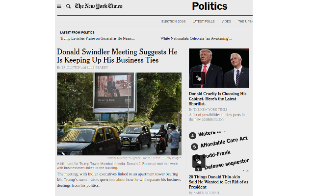

# Trumpit - A Chrome extension for calling a spade a spade

Do not allow the press to normalize the things that Trump has said,
and done, and failed to do on the way to the White House.

Every mention of his name should be a stark reminder of who and what
he is.

This extension makes that literally true.

---

Github page for this extension: [https://github.com/bobg/trumpit](https://github.com/bobg/trumpit)

Trump caricature attribution: [DonkeyHotey](https://www.flickr.com/photos/donkeyhotey/25549297376)
